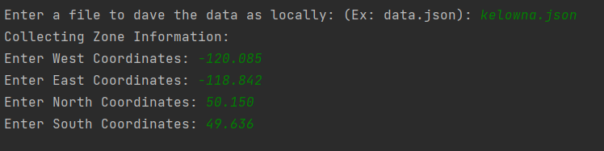
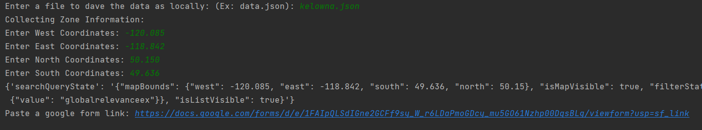

# PYTHON Projects

Collection of my python scripts from newest to oldest

## ISS Tracker/User Tracker

An django ISS Tracker, where users can create accounts that will then translate their location to geocoordinates, latitude/longitude. The user can login/logout and change their profile information such as location or name.

## pandas/matplotlib Stackoverflow Programming Language Over Time Usage

Time series analysis and plotting of the programming languages over time on Stackoverflow, and visualizing the trends. Using pandas/matplotlib.

## Blog with posts / comments / multi user authentication - 069

It's a basic blog made in flask with comments/posts and authentication. You can visit the repo [here](https://github.com/0xskar/Blog-with-Auth) to check it out.

## Flask Authentication - 068 

Flask Authorization complete, using best industry standards as not saving plaintext passwords as variables and encrypting them for storage with werkzeug.security.

Login feature with flashed messages:

The login feature uses Flasks login_user to remain logged in after user crediants are validation, which sets a session cookie containing the user's ID. Also using Werkzeug's security module to verify the user's salted passwords. 😃 

## Flask CMS - Starting - 067

Functional blog built with Flask and SQLAlchemy where you are able to get, post, delete and edit blog posts. Currently has no authentications but will work on that later.

Adding a new post:

Editing A post:

and Deleting a post is easy as hitting delete on the homepage:

## RESTful API - 066 

Created a RESTful API for a mock up coffee shop location database from scratch using Flask, and SQLAlchemy. Complete with full documentation provided by PostMan. If the database cannot find information or wrong information is inputted the API will handle these request effectively with the appropriate responses.

Using GET requests you can search for specific or all information in the database:

Can add new cafes to the database.

Patch information such as coffee prices, because inflation.

And we can delete cafes that have closed down.

## My Top 10 Movies - 64

A personal top 10 movie collector. Using Flask and wtforms and strapi. The data is pulled from strapi's db via api, then sorted from highest rating to lowest. You can edit/delete/add new movies through the app. The site uses lots of form validation and CSRF protection.

Editing a movies rating/review:

Deleting/Adding a movie

## Coffee Shop Collection - 62

Simple web app writted in python with flask templating and WTForms for inputs and validation.

You can view list of all cafes added.

You can add new shops, and the form uses validation on all inputs.

And check the newly added shops:

## Strapi Blog Project - 59

With my markdown files converted I setup a flask app that loads the most recent 25 posts from my Strapi CMS via its API. It's pretty much a fully functional blog site for now, but the markdown isn't displayed correctly, will fix that with a later update when I am making a final version to display all of my everythings on it.

## Jekyll Markdown Data Migration - 58

I needed blog posts for a Flask app I am working on so I created a script to handle the migration of my jekyll markdown files to my Strapi CMS I have setup. 

Uses frontmatter to extract the information from the markdown files on my PC, such as all of the tags and categories, then handles the posting of the information to Strapi. This way I can populate my new blog. I'm working on setting up user authentication so I can make the flask app into a frontend for that connects to the Strapi API.

## Zillower Home Price Data Collector - 53

Zillow stores its home information by latitude/longditude, so we can enter in coordinated lat/long of where you want your home prices. So we start the program by asking for the user to input desired filename for data storage locally as well as the desired coordinates:

The program will then scrape all listings for the desired area, then ask you for a google form link to input all of the data to:

The program will then use selenium to input all of the gathered data into the google form.

We can then create a new google spreadsheet and manipulate the data further however we want! Sky is the limit.

Pretty cool project to complete really good practice.

## Amazon Price Scraper/Low Price Messager - 47

This program will take an amazon URL, and use beautifulsoup to collect information such as current available price its name, the price you want to be notified at, and connect to my Strapi API to hold the information. 

You can list all of the items you are currently tracking:

Check amazon to see if there are updated prices, then update all prices in the database:

And finally, run a price scan, out an an email if there are any deals.

## Top100 Billboard Spotify Playlist Creator

Scrapes billboard top 100s using Beautiful Soup from any year entered, then using Spotipy and the spotify API connects to spotify to get the unique Spotify URI for the artist/song then uses the URI to create and modify a playlist and title with the songs collected.

## top100 movies scraper/reverse

takes the top 100 movies from empire then reverses the list and saves it to a file.

## ycombinator news scraper

Sorts the news section on ycombinator from highest to lowest scores instead of using its algorithm for easy reading

## Flight Deal Finder 

Communicates with a [Strapi](https://strapi.io/) instance that I installed on an ubuntu VM. This program connect with Strapi to collect the locations of places you would like to visit and how much you will be willing for looking to spend on a flight. It will then connect to Kiwi's Tequila API to check and see if there are flights available for lower than your set price. If there are the program can be setup to either email or SMS you. Unfortunately most email and SMS software costs money now, so for now it just prints a message. I have setup SMTP servers on my home PC but they are unable to send emails outside of the network.

TODO - Work on UI - Create user inputs and then user creation

## Sheety/OpenAI Workout Tracker 

Uses Nutritionx to generate a json response with a user inputted sentence (EG: "I went for a walk for 2 kilometers it took 15 minutes"), then uses nutritionx openAI connection to calculate calories burned. With this json information it updates your sheety connected google sheet for easy tracking.

## Yoga Tracker 

Simple script that needs to be polished. Using Pixe.la API and json to post and put and create graphs to track habits.

## Stock Trader News Alert 

Uses alphavantage and newsapi.org APIs to check a stock. Calculates if stock has fallen or risen more than 5% between two closes then can be setup to send you a SMS or email with 3 of the latest relevant news stories to the stock ticker.

## Weather it will rain/snow 

Program checks openweather API then checks if the weather ID is less then 800 for the next 24 hours it will fire off an SMS alerting you the fact.

## Quizzler

Upgraded the old quiz CLI to a tkinter quiz app that uses API requests to get a series of questions.

## ISS Tracker and EMAILer 

Every 60 seconds this program tracks the ISS using their API, also tracks sunset/sunrise using supplied latitude/longitude. Performs distance calculation from the ISS, will send out an email telling you to check outside when the ISS is closer than 5 degrees lat/long, and the sun is down.

## Kanye Says Actual Motivation Things 

Uses tkinter, request, and random, to read motivation quote API so Kanye says actually useful things rather than whatever he is going on about.

##  Birthday Reminder  

This program is using Pandas, smtplib, os, datetime, to access a supplied list of people and dates, and if hosted online (via pythonanywhere) you can use this python program to have it send you an email if someones birthday comes up today.

##  Monday Motivational Emailer 

Picks a random motivational quote from a supplied .csv then emails this to you using your configured SMTP. If hosted online this will email you every Monday.

## Flashcard Project

Flashcard project that will take ANY language that is compatible with google translate (you can create a flashcard list via google sheets using =GOOGLETRANSLATE()) and create flashcards. This will go through the list of flashcards and then create a list of words you need to work on depending on the users answer.

## New Lastpass 2.0 

Password manager 2.0. Detects if JSON file exists and if it doesn't creates it. Can also search for previously generated passwords that have been saved to the JSON file.

##  New Lastpass 

Password Manager GUI. Generates a secure password, and saves that information along with the website and username to a datafile stored locally.

##  Pomodore app

Breaks down work sessions into the pomodoro technique to allow better learning or better workflow. Tracks the number of work sessions and breaks.

##  Kilometers to miles converter in tkinter 

Uses args and kwargs to convert.

##  NATO Phonetic Name Translator 

Goes through a pandas dataframe containing NATO phonetic names, and using list comprehension cycles through the name given and outputs the NATO phonetics for any given name.

##  US States Game 

Guess the correct states in the USA. This uses pandas datafram to parse through the list of states then outputs a textfile for the states you have missed.

##  Mail Maker 

Takes a custom letter file and a name list file and combines them to create custom mail messages.

##  Snake with highscores  

Snake game but reads and writes to a datafile that contains high scores.

##  Frogger but Turtle  

Frogger game with turtle module

##  Pong 

I made pong. It's a 50 year old game and it was hard.

##  Snake Game 

Snake game with turtle module

##  Turtle Racer

Creates 6 turtles, bet on a turtle, see if your turtle is the winner. Uses OOP to assign 6 turtles different specified colors then while playing assigned each turtle random speeds while playing. End's when a turtle reaches specific coordinate.

##  Damien Hurst Dots 

A program thaat will generate a window full of dots for the specified amount of dots and size. 

##  Random Walk 

random walk in turtle

##  Quiz program 

OOP quiz program that can take many forms of question data and run a quiz against it.

##  Coffee machine v2.0

same function as before but using OOP to clean up code and improve functionality

##  Coffee machine

a coffee machine that compares the resouces it has available with different menu options and then takes payment to make a drink if the resources are available. also has a report function to display available resources and can turn off for maintenance.

##  Higher or lower game 

guess if the instagram account has higher or lower followers than another

##  number guesser 

guess a number between 1 and 100 in different definied rounds

##  blackjack  

blackjack

##  calculator 

calculator (simple)

##  silent auction program

caesar cipher encoder and decoder

##  hangman game

##  passwordgenerator.py 

Creates a random password from specified lengths 

##  highestscore.py 

picks the highest score from a list

##  fizzbuzz.py 

fizzbuzz game 

##  averageheight.py 

calculates average height 

##  addingevens.py 

adds all even numbers in a series of numbers

##  0xparse.py 

A program that crawls a website and extracts all the links from the website.

##  txt2pdf.py 

A program that converts a text file into a PDF.

##  ShowCollection.py 

A program that keeps a list of your favorite movies and TV shows, and allows you to add, remove, and search for items in the list.

##  rockpaperscissors.py 

A program that plays a simple game of rock-paper-scissors against the computer.

##  temperature_converter.py 

A program that converts temperatures from Fahrenheit to Celsius and vice versa.

##  madlib.py 

A program that generates a mad-libs story with user input.
