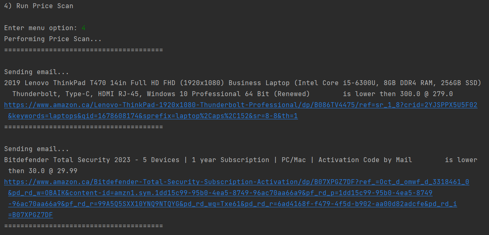

# PYTHON Projects

Collection of my python scripts from newest to oldest

### Amazon Price Scraper/Low Price Messager

This program will take an amazon URL, and use beautifulsoup to collect information such as current available price its name, the price you want to be notified at, and connect to my Strapi API to hold the information. 

You can list all of the items you are currently tracking:

Check amazon to see if there are updated prices, then update all prices in the database:

And finally, run a price scan, out an an email if there are any deals.

### Top100 Billboard Spotify Playlist Creator

Scrapes billboard top 100s using Beautiful Soup from any year entered, then using Spotipy and the spotify API connects to spotify to get the unique Spotify URI for the artist/song then uses the URI to create and modify a playlist and title with the songs collected.

### top100 movies scraper/reverse

takes the top 100 movies from empire then reverses the list and saves it to a file.

### ycombinator news scraper

Sorts the news section on ycombinator from highest to lowest scores instead of using its algorithm for easy reading

### Flight Deal Finder 

Communicates with a [Strapi](https://strapi.io/) instance that I installed on an ubuntu VM. This program connect with Strapi to collect the locations of places you would like to visit and how much you will be willing for looking to spend on a flight. It will then connect to Kiwi's Tequila API to check and see if there are flights available for lower than your set price. If there are the program can be setup to either email or SMS you. Unfortunately most email and SMS software costs money now, so for now it just prints a message. I have setup SMTP servers on my home PC but they are unable to send emails outside of the network.

TODO - Work on UI - Create user inputs and then user creation

### Sheety/OpenAI Workout Tracker 

Uses Nutritionx to generate a json response with a user inputted sentence (EG: "I went for a walk for 2 kilometers it took 15 minutes"), then uses nutritionx openAI connection to calculate calories burned. With this json information it updates your sheety connected google sheet for easy tracking.

### Yoga Tracker 

Simple script that needs to be polished. Using Pixe.la API and json to post and put and create graphs to track habits.

### Stock Trader News Alert 

Uses alphavantage and newsapi.org APIs to check a stock. Calculates if stock has fallen or risen more than 5% between two closes then can be setup to send you a SMS or email with 3 of the latest relevant news stories to the stock ticker.

### Weather it will rain/snow 

Program checks openweather API then checks if the weather ID is less then 800 for the next 24 hours it will fire off an SMS alerting you the fact.

### Quizzler

Upgraded the old quiz CLI to a tkinter quiz app that uses API requests to get a series of questions.

### ISS Tracker and EMAILer 

Every 60 seconds this program tracks the ISS using their API, also tracks sunset/sunrise using supplied latitude/longitude. Performs distance calculation from the ISS, will send out an email telling you to check outside when the ISS is closer than 5 degrees lat/long, and the sun is down.

### Kanye Says Actual Motivation Things 

Uses tkinter, request, and random, to read motivation quote API so Kanye says actually useful things rather than whatever he is going on about.

###  Birthday Reminder  

This program is using Pandas, smtplib, os, datetime, to access a supplied list of people and dates, and if hosted online (via pythonanywhere) you can use this python program to have it send you an email if someones birthday comes up today.

###  Monday Motivational Emailer 

Picks a random motivational quote from a supplied .csv then emails this to you using your configured SMTP. If hosted online this will email you every Monday.

### Flashcard Project

Flashcard project that will take ANY language that is compatible with google translate (you can create a flashcard list via google sheets using =GOOGLETRANSLATE()) and create flashcards. This will go through the list of flashcards and then create a list of words you need to work on depending on the users answer.

### New Lastpass 2.0 

Password manager 2.0. Detects if JSON file exists and if it doesn't creates it. Can also search for previously generated passwords that have been saved to the JSON file.

###  New Lastpass 

Password Manager GUI. Generates a secure password, and saves that information along with the website and username to a datafile stored locally.

###  Pomodore app

Breaks down work sessions into the pomodoro technique to allow better learning or better workflow. Tracks the number of work sessions and breaks.

###  Kilometers to miles converter in tkinter 

Uses args and kwargs to convert.

###  NATO Phonetic Name Translator 

Goes through a pandas dataframe containing NATO phonetic names, and using list comprehension cycles through the name given and outputs the NATO phonetics for any given name.

###  US States Game 

Guess the correct states in the USA. This uses pandas datafram to parse through the list of states then outputs a textfile for the states you have missed.

###  Mail Maker 

Takes a custom letter file and a name list file and combines them to create custom mail messages.

###  Snake with highscores  

Snake game but reads and writes to a datafile that contains high scores.

###  Frogger but Turtle  

Frogger game with turtle module

###  Pong 

I made pong. It's a 50 year old game and it was hard.

###  Snake Game 

Snake game with turtle module

###  Turtle Racer

Creates 6 turtles, bet on a turtle, see if your turtle is the winner. Uses OOP to assign 6 turtles different specified colors then while playing assigned each turtle random speeds while playing. End's when a turtle reaches specific coordinate.

###  Damien Hurst Dots 

A program thaat will generate a window full of dots for the specified amount of dots and size. 

###  Random Walk 

random walk in turtle

###  Quiz program 

OOP quiz program that can take many forms of question data and run a quiz against it.

###  Coffee machine v2.0

same function as before but using OOP to clean up code and improve functionality

###  Coffee machine

a coffee machine that compares the resouces it has available with different menu options and then takes payment to make a drink if the resources are available. also has a report function to display available resources and can turn off for maintenance.

###  Higher or lower game 

guess if the instagram account has higher or lower followers than another

###  number guesser 

guess a number between 1 and 100 in different definied rounds

###  blackjack  

blackjack

###  calculator 

calculator (simple)

###  silent auction program

caesar cipher encoder and decoder

###  hangman game

###  passwordgenerator.py 

Creates a random password from specified lengths 

###  highestscore.py 

picks the highest score from a list

###  fizzbuzz.py 

fizzbuzz game 

###  averageheight.py 

calculates average height 

###  addingevens.py 

adds all even numbers in a series of numbers

###  0xparse.py 

A program that crawls a website and extracts all the links from the website.

###  txt2pdf.py 

A program that converts a text file into a PDF.

###  ShowCollection.py 

A program that keeps a list of your favorite movies and TV shows, and allows you to add, remove, and search for items in the list.

###  rockpaperscissors.py 

A program that plays a simple game of rock-paper-scissors against the computer.

###  temperature_converter.py 

A program that converts temperatures from Fahrenheit to Celsius and vice versa.

###  madlib.py 

A program that generates a mad-libs story with user input.
